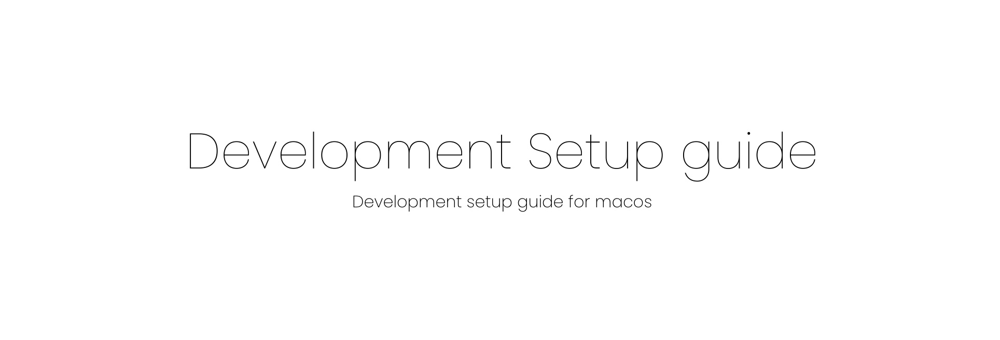

This guide covers the setup of development environment for a macos based system. This is intented for everyone from a college freshman or a professional developer and contributions are more than welcome.

This article mainly talks about the ways to customize your macos for boost your productivity.

## Contributing to the guide

Suggestions / Improvements or any other helpful contributions are always welcome, Please raise a PR with some context or any helpful links.

Feel free to reach me out at [rec.manish.sahani@gmail.com](mailto:rec.manish.sahani@gmail.com) or connect with me on [LinkedIn](https://www.linkedin.com/in/manishsahani).